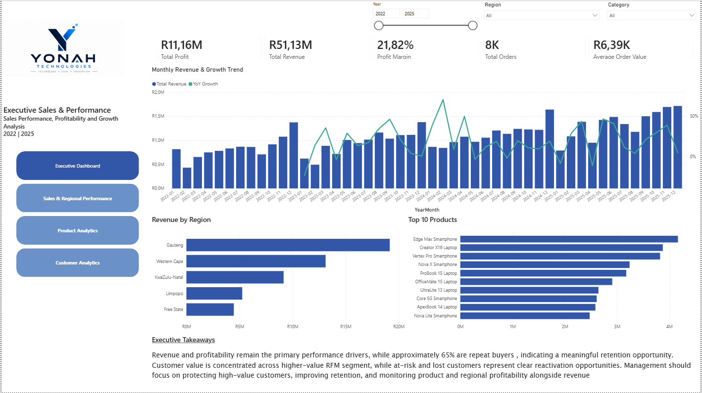
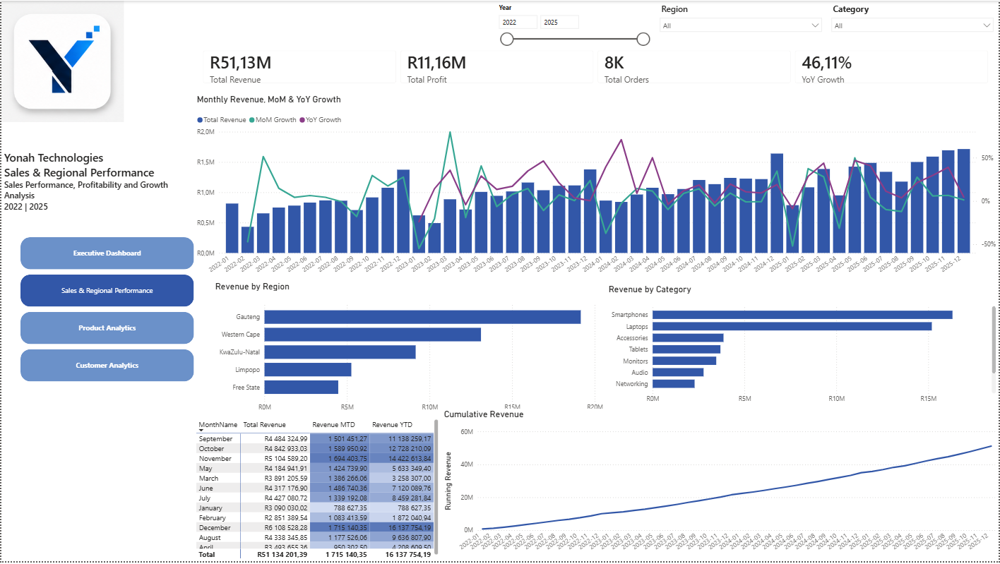
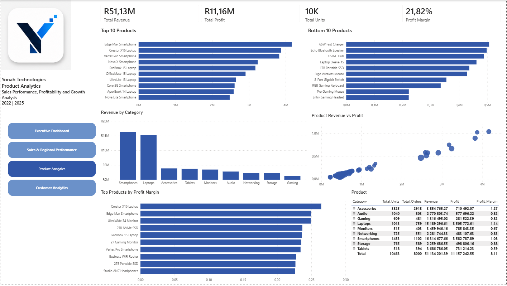
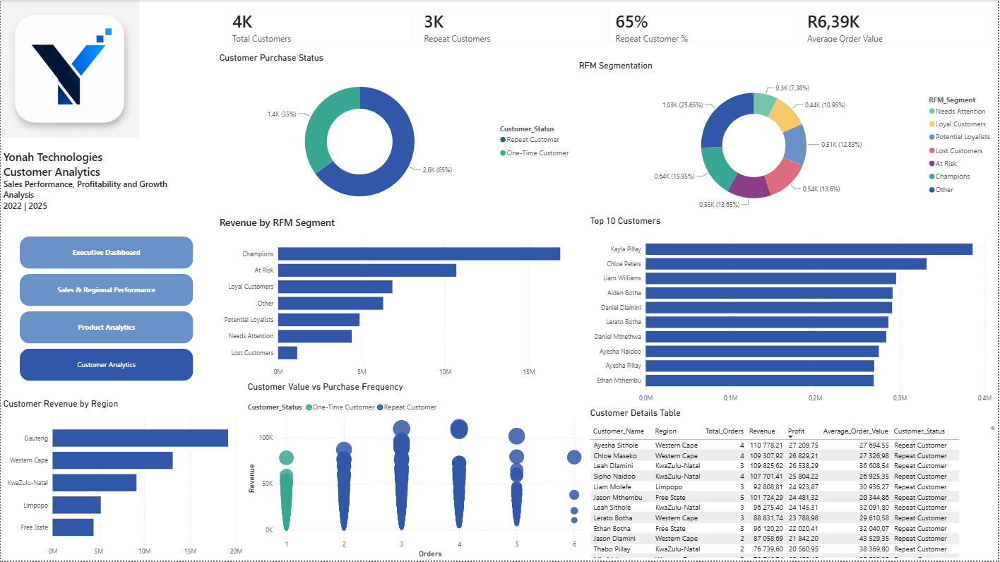

# Yonah Technologies — Business Intelligence & Sales Analytics

> An end-to-end Business Intelligence solution built with SQL Server and Power BI to analyze sales performance, profitability, customer behavior, product performance, and regional trends.

## Table of Contents

- [Project Overview](#project-overview)
- [Business Problem](#business-problem)
- [Business Objectives](#business-objectives)
- [Dataset](#dataset)
- [BI Architecture](#bi-architecture)
- [Data Model](#data-model)
- [SQL Development](#sql-development)
- [SQL Analytical Layer](#sql-analytical-layer)
- [Power BI Semantic Model](#power-bi-semantic-model)
- [DAX & Time Intelligence](#dax--time-intelligence)
- [Dashboard](#dashboard)
- [Key Business Metrics](#key-business-metrics)
- [Customer & RFM Analysis](#customer--rfm-analysis)
- [Business Insights](#business-insights)
- [Business Impact & Recommendations](#business-impact--recommendations)
- [Project Workflow](#project-workflow)
- [Tools & Technologies](#tools--technologies)
- [Project Structure](#project-structure)
- [Conclusion](#conclusion)
- [About Me](#about-me)

---

## Project Overview

Yonah Technologies is a fictional South African technology retailer operating across Gauteng, Western Cape, KwaZulu-Natal, Limpopo, and the Free State.

This project demonstrates an end-to-end Business Intelligence workflow, from structured data ingestion and dimensional modelling in SQL Server through analytical SQL, reporting-ready views, Power BI semantic modelling, DAX measures, interactive dashboards, and business recommendations.

The solution covers **January 2022 to December 2025** and focuses on:

- Sales performance
- Profitability
- Customer purchasing behavior
- Regional performance
- Product performance
- Customer segmentation
- Time-based performance trends

---

## Business Problem

Management requires a centralized Business Intelligence solution to understand how the business is performing across revenue, profitability, customers, products, regions, and time.

The analysis is designed to answer questions such as:

- How are revenue and profit performing over time?
- Which regions and product categories contribute most to revenue and profit?
- Which products are high- or low-performing?
- How significant are repeat customers to the business?
- Which customers represent high-value, at-risk, or lost segments?
- Are changes in revenue accompanied by corresponding changes in profitability?
- Where should management focus retention, reactivation, and performance improvement efforts?

---

## Business Objectives

The BI solution was developed to enable management to:

- Monitor revenue and profitability.
- Track month-over-month and year-over-year performance.
- Evaluate regional sales performance.
- Identify high- and low-performing products.
- Understand customer purchasing behavior.
- Measure repeat-customer activity.
- Segment customers using RFM analysis.
- Identify valuable, at-risk, and lost customer groups.
- Compare revenue and profitability across products and regions.
- Support data-driven commercial decisions.
- Provide an executive-level view of overall business performance.

---

## Dataset

The dataset contains approximately **8,000 sales transactions** covering four years of activity.

| Attribute | Description |
|---|---|
| Company | Yonah Technologies |
| Industry | Technology Retailer |
| Geography | South Africa |
| Provinces | Gauteng, Western Cape, KwaZulu-Natal, Limpopo, Free State |
| Sales Transactions | 8,000 |
| Customers | Approximately 4,000 |
| Repeat Customer Rate | Approximately 65% |
| Product Categories | Multiple technology categories |
| Period | January 2022 – December 2025 |
| Seasonality | Included |
| Customer Behavior | Repeat and one-time purchasing patterns |
| Discounts | Included |
| Profitability Fields | Revenue, cost, profit, and margin |

---

## BI Architecture

The project follows a layered Business Intelligence workflow that separates data preparation, analytical modelling, and reporting responsibilities.


The architecture moves from SQL Server staging and dimensional modelling through reporting-ready analytical views into the Power BI semantic model and executive reporting layer.

---

## Data Model

The core reporting model follows a **star schema**, with the central sales fact table connected to Date, Customer, and Product dimensions.


### Entity Relationship Diagram


### Core Tables

| Object | Purpose |
|---|---|
| `dim.Date` | Reporting calendar and time attributes used for time intelligence. |
| `dim.Customers` | Customer-level descriptive attributes. |
| `dim.Products` | Product-level descriptive information. |
| `fact.Sales_data` | Transaction-level sales activity connecting customer, product, and date information. |

The star schema provides a structured foundation for analytical queries and Power BI reporting.

---

## SQL Development

SQL Server was used as the primary data-engineering, modelling, validation, and analytical layer.

### Data Engineering & Modelling

The project includes:

- Data loading
- Data validation
- Data type handling
- Primary and foreign key design
- Relationship validation
- Dimensional modelling
- Date dimension
- Customer dimension
- Product dimension
- Sales fact table
- Star-schema relationships

### Analytical SQL

The analytical layer uses SQL techniques including:

- Aggregations
- Common Table Expressions (CTEs)
- `CASE` expressions
- `LAG()`
- Window functions
- Ranking
- Customer segmentation
- RFM scoring
- Performance analysis
- Time-based aggregation

---

## SQL Analytical Layer

A dedicated `gold` schema contains reporting-ready analytical views for Power BI. This layer separates transactional structures from business-facing analytical datasets and provides reusable datasets for reporting and analysis.

| Analytical View | Purpose |
|---|---|
| `gold.CustomerAnalytics` | Customer purchasing behavior and customer-level metrics |
| `gold.CustomerRFM` | Recency, Frequency, and Monetary customer segmentation |
| `gold.MonthlySalesPerformance` | Monthly revenue, profit, transactions, and AOV |
| `gold.ProductPerformance` | Product-level sales and profitability performance |
| `gold.RegionalPerformance` | Regional sales and profitability analysis |

---

## Power BI Semantic Model

Power BI was used as the semantic modelling, analytical reporting, and visualization layer.


The semantic model contains:

- Dimension tables
- Sales fact table
- Reporting-ready analytical views
- Dedicated `_Yonah Measures` table
- Relationships between dimensions and the sales fact
- DAX measures
- Interactive slicers
- Cross-filtering
- Time intelligence

This structure provides a consistent analytical layer between the underlying SQL data and the report visuals.

---

## DAX & Time Intelligence

The Power BI model includes measures for core business KPIs and time-based analysis.

### Core KPIs

- Revenue
- Profit
- Profit Margin
- Average Order Value
- Transactions
- Customers
- Units Sold

### Time Intelligence

- MTD Revenue
- YTD Revenue
- MoM Growth %
- YoY Revenue
- YoY Growth %
- Running Revenue

### Customer Analytics

- Repeat Customers
- Repeat Customer %
- Customer revenue
- Purchase frequency
- RFM segments

---

## Dashboard

The Power BI report contains five pages:

1. Dashboard Cover
2. Executive Dashboard
3. Sales & Regional Performance
4. Product Analytics
5. Customer Analytics

### Executive Dashboard



**Business question:** *What is the overall health of the business, and where should management focus attention?*

The Executive Dashboard provides a high-level view of revenue, profit, profit margin, order activity, monthly revenue trends, regional performance, and top-performing products.

---

### Sales & Regional Performance



**Business question:** *How are sales changing over time, and how do regions and categories contribute to performance?*

This page analyzes monthly revenue, MoM and YoY growth, cumulative revenue, regional performance, and category contribution.

---

### Product Analytics



**Business question:** *Which products generate the most revenue and profit, and where are there differences between sales performance and profitability?*

This page evaluates top and bottom products, category performance, product revenue versus profit, profit margins, units sold, and product-level performance.

---

### Customer Analytics



**Business question:** *Who are the most valuable customers, how frequently do they purchase, and which customer groups require retention or reactivation?*

This page analyzes customer counts, repeat-customer activity, RFM segments, top customers, customer revenue, purchasing frequency, and customer-level details.

---

## Key Business Metrics

The current model produces approximately:

| KPI | Result |
|---|---:|
| Customers | 4K |
| Repeat Customers | 3K |
| Orders | 8K |
| Revenue | R51.13M |
| Profit | R11.16M |
| Overall Profit Margin | 21.8% |
| Average Order Value | R6.38K |

---

## Customer & RFM Analysis

The model uses **Recency, Frequency, and Monetary (RFM) analysis** to differentiate customers according to purchasing behavior and value.

Customer segments include:

- Champions
- Loyal Customers
- Potential Loyalists
- At Risk
- Needs Attention
- Lost Customers
- Other

The analysis supports targeted customer retention, reactivation, and customer-value strategies.

---

## Business Insights

The analysis highlights several commercially relevant themes:

### Repeat-Customer Behavior
Approximately **65% of customers are repeat customers**, indicating that repeat purchasing represents an important component of the business.

### Customer Value Concentration
RFM analysis shows that customer value is not evenly distributed. Higher-value segments contribute disproportionately to revenue and should receive targeted retention attention.

### Revenue vs. Profitability
Product analysis separates revenue performance from profitability, helping identify products that generate strong sales but do not necessarily deliver equivalent profit contribution.

### Regional Performance
The model supports comparison across five regions using revenue, profit, and order activity, enabling management to identify differences in regional performance.

### Customer Frequency vs. Value
The customer scatter analysis shows the relationship between purchasing frequency and customer revenue, helping distinguish frequent customers from customers who generate genuinely high monetary value.

---

## Business Impact & Recommendations

### 1. Protect High-Value Customers
Prioritize Champions and other high-value RFM segments with retention strategies and personalized offers.

**Expected business impact:** Protect valuable revenue and reduce the risk of losing high-value customers.

### 2. Re-engage At-Risk Customers
Use the At Risk and Needs Attention segments to develop targeted reactivation campaigns based on historical purchasing behavior.

**Expected business impact:** Recover declining customer activity and increase repeat purchases.

### 3. Investigate Lost Customers
Analyze historical purchasing behavior and customer characteristics to identify common patterns among Lost Customers.

**Expected business impact:** Improve understanding of customer churn and identify opportunities for win-back strategies.

### 4. Strengthen Regional Decision-Making
Monitor regional performance using revenue, profit, and margin rather than revenue alone.

**Expected business impact:** Support better allocation of commercial resources toward regions that combine sales volume with healthy profitability.

### 5. Monitor Customer Retention
Use Repeat Customer % as a recurring management KPI.

**Expected business impact:** Provide an ongoing indicator of customer retention and the stability of repeat revenue.

### 6. Use Time Intelligence for Performance Management
Use MTD, YTD, MoM, and YoY measures to identify growth, slowdowns, and seasonal patterns.

**Expected business impact:** Give management a consistent framework for monitoring changes in business performance over time.

---

## Project Workflow

```text
Source Data
    ↓
SQL Server Staging
    ↓
Data Validation & Transformation
    ↓
Star Schema
    ↓
Analytical SQL / Gold Views
    ↓
Power BI Semantic Model
    ↓
DAX Measures & Time Intelligence
    ↓
Interactive Dashboards
    ↓
Business Insights & Recommendations
```

---

## Tools & Technologies

| Technology | Purpose |
|---|---|
| SQL Server | Data storage, dimensional modelling, validation, and analytical SQL |
| SQL Server Management Studio | Database development and administration |
| Power BI Desktop | Semantic modelling, visualization, and reporting |
| DAX | Measures and time intelligence |
| Draw.io | ERD and BI architecture diagrams |
| Microsoft Excel | Source data preparation |
| GitHub | Portfolio presentation and project documentation |
| Databricks | Data and analytics learning environment |

---

## Project Structure

```text
Yonah-Technologies/
│
├── Data/
│   ├── Customers.csv
│   ├── Products.csv
│   └── Sales_Data.csv
│
├── SQL/
│   ├── Create Database/
│   ├── Create Tables/
│   ├── Load_Data/
│   ├── Analytical_Views/
│   └── Validation/
│
├── PowerBI/
│   └── Yonah_BI.pbix
│
├── Images/
│   ├── Architecture.png
│   ├── Star_Schema.png
│   ├── ERD.png
│   ├── PowerBI_Semantic_Model.png
│   ├── Executive_Dashboard.png
│   ├── Sales_Regional_Performance.png
│   ├── Product_Analytics.png
│   └── Customer_Analytics.png
│
└── README.md
```

---

## Conclusion

The Yonah Technologies Sales Analytics project demonstrates an end-to-end Business Intelligence workflow rather than a standalone dashboard.

The solution combines:

**SQL Server + Dimensional Modelling + Analytical SQL + Reporting-Ready Views + Power BI + DAX + RFM Segmentation + Time Intelligence + Executive Reporting**

The resulting analytical environment provides a structured way to evaluate sales performance, profitability, customer behavior, regional activity, product performance, and business growth within a single reporting solution.

---

## About Me

I am building my career in Data Analytics and Business Intelligence, with a focus on using SQL, Power BI, DAX, data modelling, and Excel to transform raw data into structured analysis and actionable business insights.

This project demonstrates my ability to work across the analytics lifecycle, from data preparation and dimensional modelling through analytical SQL, semantic modelling, visualization, customer segmentation, and business recommendations.

### Technical Focus

- SQL
- Microsoft Power BI
- DAX
- Data Modelling
- Excel
- Analytical Problem Solving
- Databricks


